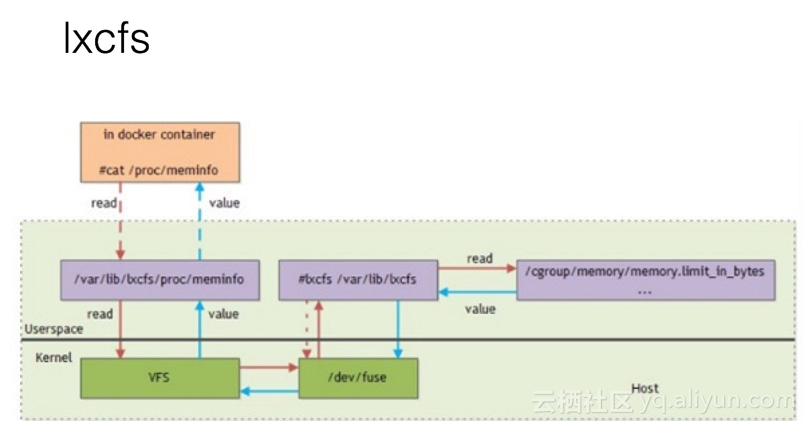

# lxcfs 安装使用

## 简介

lxcfs 用于优化容器的隔离性，提供容器资源可见性，主要利用 FUSE（用户态文件系统）来实现。



## 安装使用 

### yum 安装

下载安装包：

```
wget https://copr-be.cloud.fedoraproject.org/results/ganto/lxd/epel-7-x86_64/00486278-lxcfs/lxcfs-2.0.5-3.el7.centos.x86_64.rpm
```

有 fuse-libs 的依赖包，直接用 yum 安装即可：
 
```
yum install -y lxcfs-2.0.5-3.el7.centos.x86_64.rpm
```

修改配置：

```
vi /usr/lib/systemd/system/lxcfs.service

[Unit]
Description=FUSE filesystem for LXC
ConditionVirtualization=!container
Before=lxc.service
Documentation=man:lxcfs(1)

[Service]
ExecStart=/usr/bin/lxcfs /var/lib/lxcfs/
KillMode=process
Restart=on-failure
ExecStopPost=-/bin/fusermount -u /var/lib/lxcfs
Delegate=yes

# add remount script
ExecStartPost=/usr/bin/bash /root/container_remount_lxcfs.sh

[Install]
WantedBy=multi-user.target

```

将 /var/lib/lxcfs/ 改为： /var/lib/lxc/lxcfs/

增加： ExecStartPost=/usr/bin/bash /root/container\_remount_lxcfs.sh

```
cat container\_remount_lxcfs.sh

LXCFS="/var/lib/lxc/lxcfs"

containers=$(docker ps | awk '{print $1}' |grep -v CONTAINER)
for container in $containers;do
        echo "remount $container"
        PID=$(docker inspect $container |grep Pid | awk 'NR==1{print $2}'| awk -F ',' '{print $1}' )
        for file in meminfo cpuinfo stat uptime swaps diskstats;do
                nsenter --target $PID --mount --  mount -B "$LXCFS/proc/$file" "/proc/$file"
        done
 done

```

增加一级 lxc 目录，创建容器时将 lxc 目录挂载给容器，利用自动挂载脚本解决 lxcfs 服务重启时容器内 /proc 下文件访问异常的问题 [issues 193](https://github.com/lxc/lxcfs/issues/193)，脚本实现参考阿里 pouch 解决方案 [pouch 140](https://github.com/alibaba/pouch/issues/140).

启动 lxcfs 服务：

```
systemctl daemon-reload && systemctl start lxcfs
```

### daemonset 方式安装

在 k8s 集群中，以 daemonset 方式安装 lxcfs，有开源项目实现：

```
git clone https://github.com/denverdino/lxcfs-initializer.git
```

这个项目除了以 daemonset 方式运行 lxcfs，还提供了利用 k8s initializer 功能自动挂载 volume 给 pod，这里只介绍 daemonset 方式安装 lxcfs, 主机侧需先安装 fuse-libs：

```
yum install fuse-libs -y
```

```
cd lxcfs-initializer/
[root@gzy-vm lxcfs-initializer]# ls
build            Gopkg.lock            lxcfs-image             README.md
build-container  Gopkg.toml            lxcfs-initializer.yaml  vendor
Dockerfile       lxcfs-daemonset.yaml  main.go                 web.yaml
```

直接使用 lxcfs-daemonset.yaml 创建：

```
kubectl create -f lxcfs-daemonset.yaml
daemonset.apps/lxcfs created
[root@gzy-vm lxcfs-initializer]# kubectl get po
NAME          READY   STATUS             RESTARTS   AGE
lxcfs-vpkjc   0/1     CrashLoopBackOff   1          19s
```

查看容器日志：

```
docker logs a44bcba0193b
nsenter: failed to execute lxcfs: No such file or directory

which lxcfs
/usr/bin/which: no lxcfs in (/usr/local/sbin:/usr/local/bin:/usr/sbin:/usr/bin:/root/bin:/usr/local/go/bin:/usr/local/go/bin:/usr/local/go/bin:/root/bin)
```
由于主机没有安装 lxcfs 包，所以没有 lxcfs 可执行的二进制文件，下面进一步分析。

```
[root@gzy-vm lxcfs-initializer]# cd lxcfs-image/
[root@gzy-vm lxcfs-image]# ls
Dockerfile  start.sh
```
查看 lxcfs-daemonset 容器镜像的 Dockerfile

```
FROM centos:7 as build
RUN yum -y install fuse-devel pam-devel wget install gcc automake autoconf libtool make
ENV LXCFS_VERSION 2.0.8
RUN wget https://linuxcontainers.org/downloads/lxcfs/lxcfs-$LXCFS_VERSION.tar.gz && \
        mkdir /lxcfs && tar xzvf lxcfs-$LXCFS_VERSION.tar.gz -C /lxcfs  --strip-components=1 && \
        cd /lxcfs && ./configure && make
RUN mkdir /output && cp /lxcfs/lxcfs /output && cp /lxcfs/.libs/liblxcfs.so /output

FROM centos:7
STOPSIGNAL SIGINT
ADD start.sh /
COPY --from=build /output/lxcfs /usr/local/bin/lxcfs
COPY --from=build /output/liblxcfs.so /usr/local/lib/lxcfs/liblxcfs.so
COPY --from=build /usr/lib64/libfuse.so.2.9.2 /usr/lib64/libfuse.so.2.9.2
COPY --from=build /usr/lib64/libulockmgr.so.1.0.1 /usr/lib64/libulockmgr.so.1.0.1
RUN ln -s /usr/lib64/libfuse.so.2.9.2 /usr/lib64/libfuse.so.2 && \
    ln -s /usr/lib64/libulockmgr.so.1.0.1 /usr/lib64/libulockmgr.so.1

CMD ["/start.sh"]
```

其中：

```
COPY --from=build /output/lxcfs /usr/local/bin/lxcfs
```
已经将编译出的 lxcfs 文件拷贝到 /usr/local/bin 下面，再看 lxcfs-daemonset.yaml：

```
apiVersion: apps/v1beta2
kind: DaemonSet
metadata:
  name: lxcfs
  labels:
    app: lxcfs
spec:
  selector:
    matchLabels:
      app: lxcfs
  template:
    metadata:
      labels:
        app: lxcfs
    spec:
      hostPID: true
      tolerations:
      - key: node-role.kubernetes.io/master
        effect: NoSchedule
      containers:
      - name: lxcfs
        image: registry.cn-hangzhou.aliyuncs.com/denverdino/lxcfs:2.0.8-1
        imagePullPolicy: Always
        securityContext:
          privileged: true
        volumeMounts:
        - name: cgroup
          mountPath: /sys/fs/cgroup
        - name: lxcfs
          mountPath: /var/lib/lxcfs
          mountPropagation: Bidirectional
        - name: usr-local
          mountPath: /usr/local
      volumes:
      - name: cgroup
        hostPath:
          path: /sys/fs/cgroup
      - name: usr-local
        hostPath:
          path: /usr/local
      - name: lxcfs
        hostPath:
          path: /var/lib/lxcfs
          type: DirectoryOrCreate
``` 

将 host 上的 

/usr/local

/sys/fs/cgroup

/var/lib/lxcfs 

挂给容器，将容器内的 /usr/local/bin/lxcfs 覆盖掉了。

解决方案：

- host 侧安装 lxcfs，将 lxcfs 可执行文件托管给 daemonset

- 修改镜像，避免编译出的 lxcfs 被覆盖

第一种方式比较简单，直接装 lxcfs rpm 包，不启动服务即可，下面介绍第二种方式：

修改 Dockerfile：

```
COPY --from=build /output/lxcfs /root/lxcfs
```
修改 start.sh

```
# Prepare
[[ ! -f "/usr/local/bin/lxcfs" ]] && cp /root/lxcfs /usr/local/bin/lxcfs
```
另外需将 start.sh 中所有 /var/lib/lxcfs 路径更换为 /var/lib/lxc/lxcfs，以便可以将 lxc 整个路径挂给容器。

制作镜像：
```
docker build -t lxcfs-dev:1.0 .
```

修改 lxcfs-daemonset.yaml

```
image: lxcfs-dev:1.0
imagePullPolicy: Never 
```
/var/lib/lxcfs 路径更换为 /var/lib/lxc/lxcfs, 创建 daemonset：

```
[root@gzy-vm lxcfs-initializer]# kubectl create -f lxcfs-daemonset.yaml
daemonset.apps/lxcfs created
[root@gzy-vm lxcfs-initializer]# kubectl get po
NAME          READY   STATUS    RESTARTS   AGE
lxcfs-gkwvr   1/1     Running   0          3s
```

注：lxcfs-initializer 最新合入使用 3.0.4 版本, 解决了主机需要安装 lxcfs 的问题 [Update to lxcfs 3.0.4](https://github.com/denverdino/lxcfs-initializer/commit/497b859323c190c32eb1339fd66066ccd93133ba)

## 创建容器验证 lxcfs


